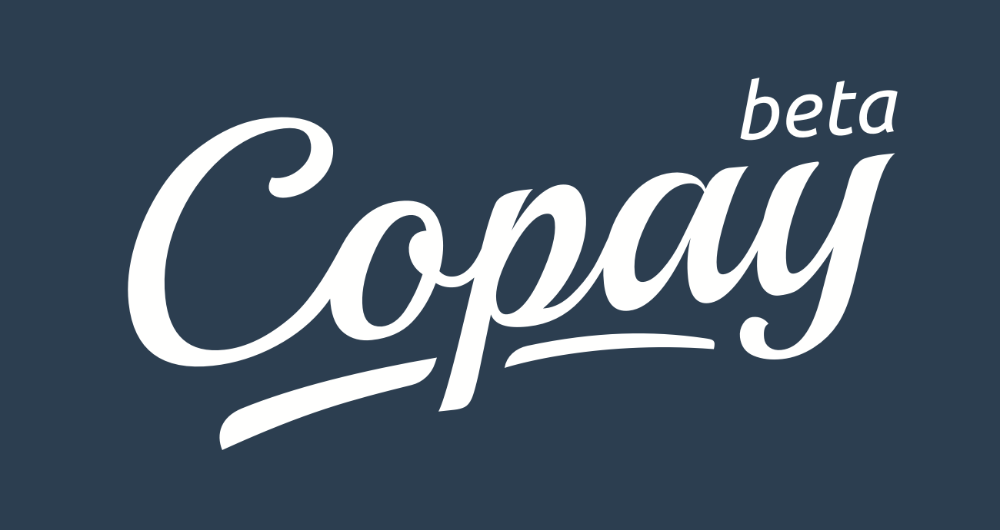
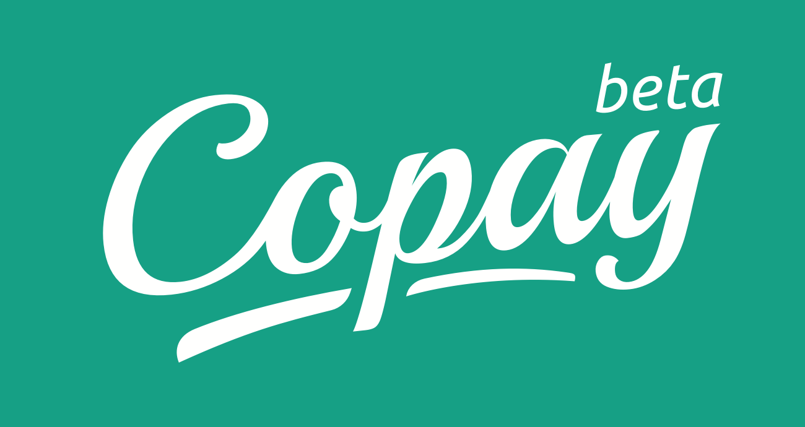
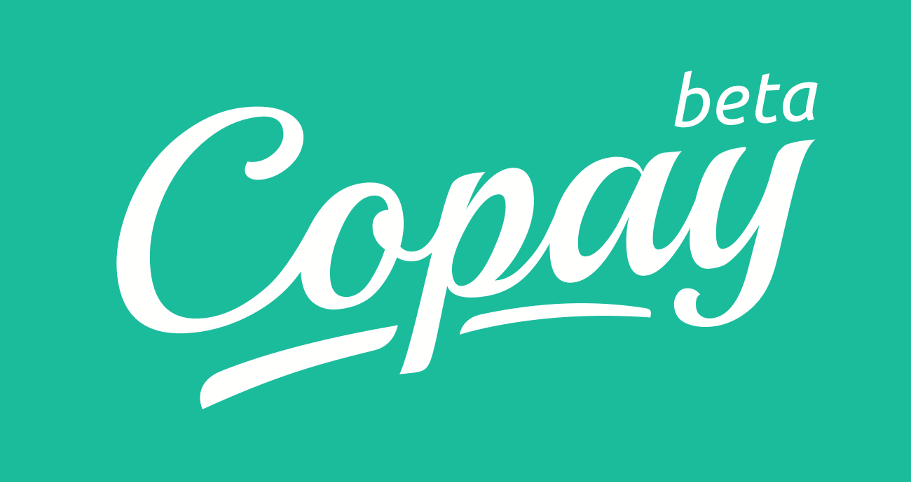
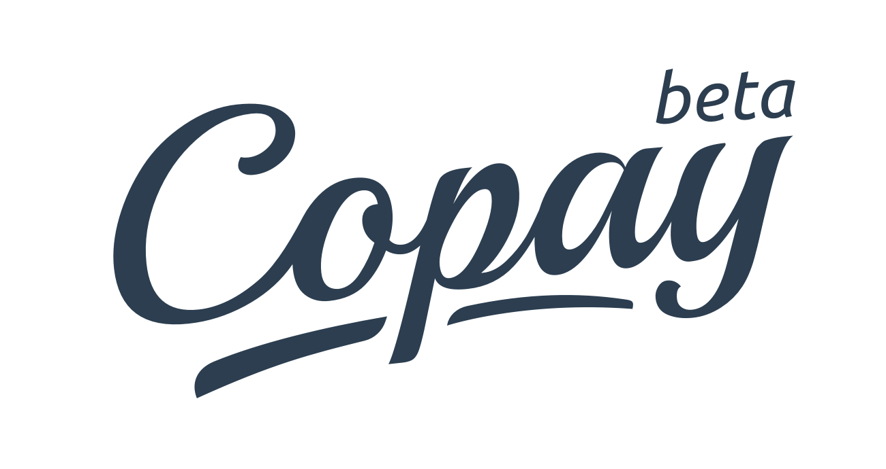

Copay Brand Guide
=================

##Logo

###Primary logo
White logo on the Copay blue background.

###Secondary logos
White logo on the Copay green shades background.

###Logo in negative

##Copay

Copay is written with capital `C`. In code, `copay` is all lowercase.

- ✓ **Copay**
- ✓ **`copay`**
- × *CoPay*
- × *coPay*
- × *co-pay*
- × *co pay*

##Color Palette

5 colors palette can be found here: http://coolors.co/2c3e50-16a085-1abc9c-f2f5f8-93a9bd

#####Hex
- Blue `#2C3E50`
- Green 1 `#16A085`
- Green 2 `#1ABC9C`
