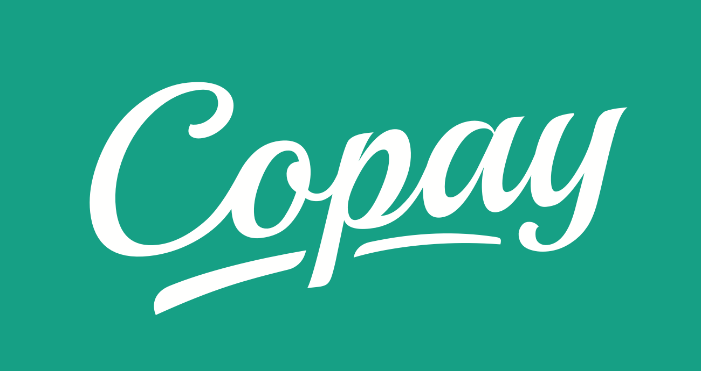
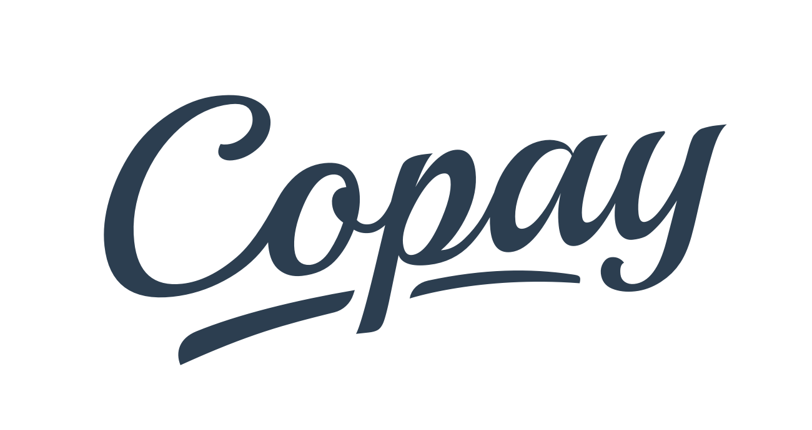

Copay Brand
============

Copay is a secure bitcoin wallet for friends and companies. Easy-to-use multisignature bitcoin wallet, bringing corporate-level security to ordinary people.

When friends or company executives join a Copay wallet, more than one person must sign every transaction. If your computer is compromised and your private keys are stolen, the bitcoins are still safe. This is in addition to state-of-the-art encrypted storage and communication.

##Logo
###Primary logo
[white logo](copay-logo-full.png) on the Copay blue background.

###Secondary logos
[white logo] on the Copay green shades background.

###Logo in negative

##Copay

Copay is written with capital `C`. In code, `copay` is all lowercase.

- ✓ **Copay**
- ✓ **`copay`**
- × *CoPay*
- × *coPay*
- × *co-pay*
- × *co pay*

##Color Palette

5 colors palette can be found here: http://coolors.co/2c3e50-16a085-1abc9c-f2f5f8-93a9bd

##BitPay Blue

The BitPay Blue is PMS 295. Please use official Pantone Matching System swatches where available.

###Close Matches

####sRGB

| Red | Green | Blue |
|:---:|:-----:|:----:|
|  0  |   40  |  85  |

#####Hex
`#002855`

####Bridge CMYK

| Cyan | Magenta | Yellow | Key (Black) |
|:----:|:-------:|:------:|:-----------:|
| 100  |   69    |   8    |      54     |
